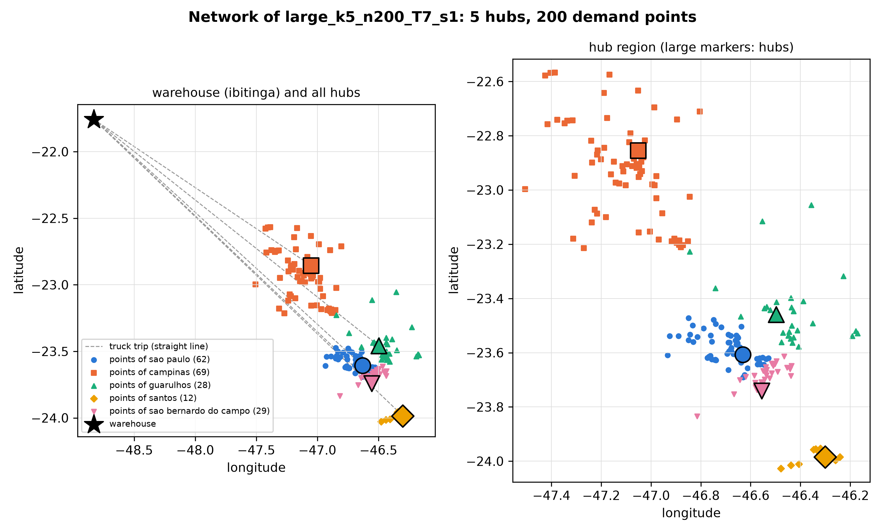
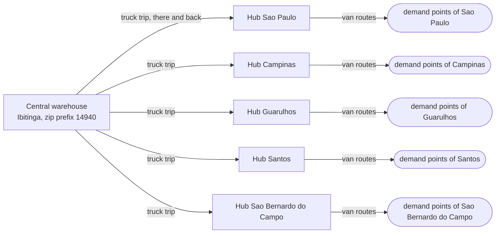
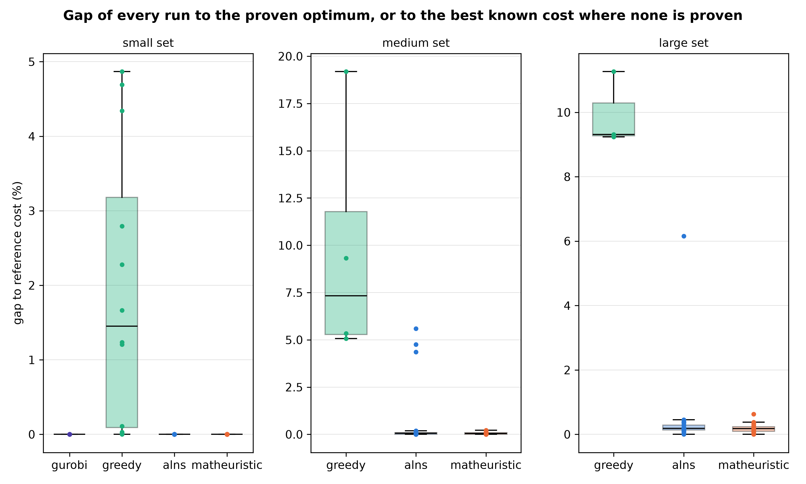
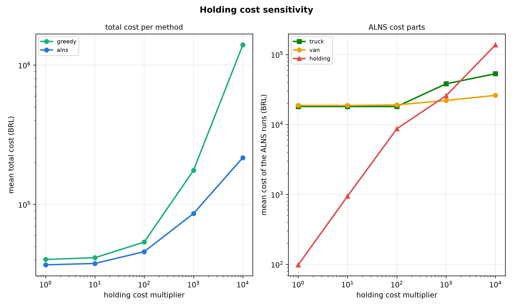

# Two-echelon inventory routing on real e-commerce data from Sao Paulo

[](https://github.com/hajibabaie/two-echelon-inventory-routing/actions/workflows/ci.yml)
[](https://www.python.org/downloads/)
[](LICENSE)

**Paper (PDF): [report/report.pdf](report/report.pdf)**

A central warehouse sends goods by truck to city hubs. Each hub sends goods by van to its
demand points. Every day we decide which hubs get a truck, which points get a van, in which
order the vans drive, and how many kg each stop gets. No point may run out of stock. This
planning problem is the two-echelon inventory routing problem (2E-IRP). This repository solves
it on real orders of the Olist online shop in Sao Paulo state, with road distances from
OpenStreetMap. It compares four methods: a greedy rule, an exact model solved by Gurobi, an
adaptive large neighborhood search (ALNS), and a matheuristic (the ALNS plus a linear program).
Gurobi proves the optimum on all 12 small instances. The ALNS reaches that optimum in
120 of 120 runs and the matheuristic in 120 of 120, while the greedy rule is
0.00 % to 4.87 % above it. On the medium and large instances both
search methods beat the greedy rule in 140 of 140 runs. A paired statistical test (the Wilcoxon
signed-rank test) gives p = 0.0020 on every instance. The same test finds no real difference
between the matheuristic and the plain ALNS on any instance, and this README explains why.

For a walk through every method on a 3-point example you can follow with a pencil, read
[docs/explained.md](docs/explained.md). The full model and discussion are in the report,
[report/report.pdf](report/report.pdf).



*The network of `large_k5_n200_T7_s1`. Left: the warehouse in Ibitinga and the dashed truck
trips to the five hubs. Right: the hub region, with each demand point in the color and shape of
its hub. Lines are straight, not road geometry.*

## Contents

- [The problem in plain words](#the-problem-in-plain-words)
- [The mathematical model](#the-mathematical-model)
- [The data](#the-data)
- [Assumptions and parameters](#assumptions-and-parameters)
- [Instance sets](#instance-sets)
- [The four methods](#the-four-methods)
- [The one solution checker](#the-one-solution-checker)
- [Results](#results)
- [What the results show](#what-the-results-show)
- [Limits of this study](#limits-of-this-study)
- [Install](#install)
- [Reproduce every step](#reproduce-every-step)
- [Repository structure](#repository-structure)
- [Testing](#testing)
- [References](#references)
- [License](#license)
- [Author](#author)

## The problem in plain words



There are two levels (echelons) of transport:

1. From the warehouse to the hubs, a hired truck drives to one hub and back. A hub gets at most
   one truck per day. A trip has a fixed charge plus a cost per km.
2. From each hub to its demand points, a small fleet of vans drives. A van leaves the hub, visits
   some of the hub's points in an order we choose, and comes back. A van has a capacity in kg.
   Each point belongs to its nearest hub and gets at most one visit per day.

Hubs and points hold stock. Each has a capacity and a start stock. Stock left at the end of a day
costs money (holding cost). The demand of each point on each day is known in advance.

One day runs in the same order as in the branch-and-price paper of Charaf et al. (2024):
the truck arrives at the hub, then the vans load at the hub and deliver, then the points sell
their demand, then holding cost is charged on what is left. Goods that reach a hub in the morning
may leave on a van the same day. The warehouse has unlimited stock and no holding cost.

The plan covers T days. The goal is the lowest total cost:

**total cost = truck trips + van km + holding cost**

and the rules are: no point runs out, no stock goes above its capacity, no van carries more than
its capacity, and a hub can only send what it has.

## The mathematical model

The exact model is a mixed-integer program (MIP): some variables can only be 0 or 1, the others
are real numbers. This is a short version. The full model, with every index and the reason for each
rule, is in the report: [report/report.pdf](report/report.pdf). The code is `src/irp2e/model.py`, where one
function builds one group of rules.

### Sets and data

| Symbol | Meaning |
| --- | --- |
| $H$ | hubs |
| $N_h$ | demand points of hub $h$ (each point belongs to its nearest hub); $N$ is all points |
| $\mathcal{T}$ | days $0, \dots, T-1$ |
| $B$ | vans of one hub, $m$ of them |
| $V_h = \lbrace h \rbrace \cup N_h$, $A_h$ | nodes of hub $h$ and all arcs between them |
| $d_{it}$ | demand of point $i$ on day $t$ (kg) |
| $U_i$, $C_h$ | capacity of point $i$ and of hub $h$ (kg) |
| $I_i^0$, $I_h^0$ | start stock (kg) |
| $Q^1$, $Q^2$ | truck and van capacity (kg) |
| $g_h = f^1 + 2 c^1 \delta_{0h}$ | cost of one truck trip to hub $h$: fixed charge plus km cost on both legs |
| $c^2$ | van cost per km |
| $\delta_{ij}$ | road km between nodes $i$ and $j$ |
| $\eta^H$, $\eta^P$ | holding cost per kg per day at hubs and at points |

### Variables

| Variable | Meaning |
| --- | --- |
| $z_{ht} \in \lbrace 0,1 \rbrace$ | a truck drives to hub $h$ and back on day $t$ |
| $y_{ht} \ge 0$ | kg the truck brings to hub $h$ on day $t$ |
| $x_{ijbt} \in \lbrace 0,1 \rbrace$ | van $b$ drives arc $(i,j)$ on day $t$ |
| $v_{ibt} \in \lbrace 0,1 \rbrace$ | van $b$ visits point $i$ on day $t$ |
| $w_{hbt} \in \lbrace 0,1 \rbrace$ | van $b$ of hub $h$ is used on day $t$ |
| $q_{ibt} \ge 0$ | kg van $b$ gives to point $i$ on day $t$ |
| $u_{ibt}$ | position of point $i$ on the route of van $b$ (it stops small loops that skip the hub, called subtours) |
| $I_{ht} \ge 0$, $I_{it} \ge 0$ | stock at the end of day $t$ at hub $h$ and point $i$ |

### Objective

Truck trips, plus van km, plus holding cost on the stock at the end of each day.

$$
\min \sum_{t \in \mathcal{T}} \sum_{h \in H} g_h z_{ht}
+ c^2 \sum_{h \in H} \sum_{b \in B} \sum_{t \in \mathcal{T}} \sum_{(i,j) \in A_h} \delta_{ij} x_{ijbt}
+ \sum_{t \in \mathcal{T}} \Big( \eta^H \sum_{h \in H} I_{ht} + \eta^P \sum_{i \in N} I_{it} \Big)
$$

### Main constraints

The numbers match the docstrings in `model.py`. The stock before day 0 is the start stock:
$I_{h,-1} = I_h^0$ and $I_{i,-1} = I_i^0$.

$$
y_{ht} \le \min(C_h, Q^1)\, z_{ht} \qquad \text{(1) goods reach a hub only on a truck day}
$$

$$
I_{h,t-1} + y_{ht} \le C_h, \qquad
I_{ht} = I_{h,t-1} + y_{ht} - \sum_{i \in N_h} \sum_{b \in B} q_{ibt} \qquad \text{(2), (3) hub capacity and hub stock}
$$

$$
I_{i,t-1} + \sum_{b \in B} q_{ibt} \le U_i, \qquad
I_{it} = I_{i,t-1} + \sum_{b \in B} q_{ibt} - d_{it} \qquad \text{(4), (5) point capacity and point stock}
$$

$$
\sum_{b \in B} v_{ibt} \le 1, \qquad
\sum_{j \in V_h} x_{ijbt} = \sum_{j \in V_h} x_{jibt} = v_{ibt} \qquad \text{(6), (7) one visit per day, one arc in and one out}
$$

$$
\sum_{j \in N_h} x_{hjbt} = \sum_{j \in N_h} x_{jhbt} = w_{hbt} \qquad \text{(8) a used van leaves its hub once and comes back}
$$

$$
q_{ibt} \le \min(U_i, Q^2)\, v_{ibt}, \qquad
\sum_{i \in N_h} q_{ibt} \le Q^2 w_{hbt} \qquad \text{(9), (10) delivery only on a visit, van capacity}
$$

$$
u_{jbt} \ge u_{ibt} + 1 - |N_h| (1 - x_{ijbt}) \qquad \text{(11) every loop passes the hub (MTZ rule: Miller, Tucker and Zemlin 1960)}
$$

$$
w_{hbt} \le w_{h,b-1,t} \qquad \text{(12) use van } b \text{ only if van } b-1 \text{ is used}
$$

Stock variables have a lower bound of 0. That bound is the no-stockout rule at points and the
"send only what you have" rule at hubs. Gurobi runs with `MIPGap = 0` (prove optimality) and
`IntegralityFocus = 1`, so a binary variable that is almost 0 cannot carry a delivery.

## The data

### Orders from Olist

The demand comes from the
[Brazilian E-Commerce Public Dataset by Olist](https://www.kaggle.com/datasets/olistbr/brazilian-ecommerce)
(Kaggle dataset `olistbr/brazilian-ecommerce`, version 2). The data is by Olist and is shared under
the [CC BY-NC-SA 4.0](https://creativecommons.org/licenses/by-nc-sa/4.0/) license. The raw files
are not in this repository. `scripts/download_data.py` downloads them with `kagglehub` and checks
the SHA-256 hash (a fingerprint of the file) of each of the six files we use: orders, customers,
order items, products, sellers and geolocation. If one file differs, the script stops and names it.

How the processed files are built (`src/irp2e/data/preprocess.py`):

- We keep the orders of customers in Sao Paulo state (`SP`) with status `delivered`: 40,501
  orders with items. The weight of an order is the sum of its product weights. 4 orders have an
  item without a weight and are dropped. The purchase date is the day the demand appears.
- Each zip prefix (the first 5 digits of a Brazilian zip code) gets the median latitude and
  longitude of its geolocation rows inside a box around the state. The median ignores the few rows
  that point far away. 13 prefixes (14 orders) have no coordinate and are dropped. 5,545 prefixes
  remain.
- The warehouse is the zip prefix with the most Olist sellers: 14940 in Ibitinga, with
  49 sellers.
- The hubs are the five Sao Paulo cities with the most delivered kg. Each hub sits at the zip
  prefix with the most orders in its city. An instance with $k$ hubs uses the first $k$ of this
  list.
- A demand point is one zip prefix. It must lie within the last-mile radius of its nearest hub
  (straight line). The 300 busiest prefixes form a pool, and an instance draws its points from the
  pool with a fixed seed. A hub's own prefix is never a demand point, so the demand of that one
  prefix is not served.
- One real week has almost no orders per prefix. So we fold one year onto one week: the demand of
  a point on Monday is the sum of all its orders placed on a Monday between 2017-08-07 and
  2018-08-05 (52 full weeks), and so on for each weekday. In plain words, each demand point is a
  pickup point that receives one year of its zip area's orders in one week. The folded week of all
  5,545 prefixes holds 70,555.6 kg (`data/processed/demand_week.csv`).

<details>
<summary>Why the fold window starts on 2017-08-07: kept Sao Paulo orders per purchase month</summary>

Computed from the raw Olist files with the functions of `preprocess.py` (delivered orders of
customers in Sao Paulo state, orders with a missing weight dropped). The months before August 2017
are thin, and November and December 2016 have no orders at all. "part" means the month is only
partly inside the window.

| Month | Orders | kg | In the fold window |
| --- | ---: | ---: | --- |
| 2016-09 | 1 | 3.0 | no |
| 2016-10 | 94 | 227.6 | no |
| 2017-01 | 283 | 724.7 | no |
| 2017-02 | 601 | 1,579.1 | no |
| 2017-03 | 965 | 2,244.8 | no |
| 2017-04 | 872 | 2,163.5 | no |
| 2017-05 | 1,363 | 3,571.0 | no |
| 2017-06 | 1,284 | 3,303.7 | no |
| 2017-07 | 1,542 | 4,415.0 | no |
| 2017-08 | 1,664 | 3,858.2 | part |
| 2017-09 | 1,576 | 3,680.5 | all |
| 2017-10 | 1,723 | 3,966.3 | all |
| 2017-11 | 2,899 | 6,888.2 | all |
| 2017-12 | 2,295 | 5,163.4 | all |
| 2018-01 | 2,975 | 7,133.2 | all |
| 2018-02 | 2,632 | 5,404.7 | all |
| 2018-03 | 2,971 | 7,215.6 | all |
| 2018-04 | 3,002 | 7,771.4 | all |
| 2018-05 | 3,138 | 7,350.0 | all |
| 2018-06 | 2,738 | 6,050.6 | all |
| 2018-07 | 2,715 | 5,519.0 | all |
| 2018-08 | 3,164 | 6,280.7 | part |

</details>

The five hubs (from `data/processed/sites.json` and the instance file `large_k5_n200_T7_s1.json`):

| Rank | City | Zip prefix | Delivered kg (all orders) | Straight line to warehouse (km) | Road km to warehouse | One truck trip (BRL) | Points in large_k5_n200_T7_s1 |
| ---: | --- | --- | ---: | ---: | ---: | ---: | ---: |
| 1 | sao paulo | 04140 | 32,718.7 | 305.3 | 350.1 | 3,240.23 | 62 |
| 2 | campinas | 13087 | 3,382.1 | 219.8 | 253.1 | 2,467.55 | 69 |
| 3 | guarulhos | 07190 | 2,702.3 | 305.1 | 359.1 | 3,311.89 | 28 |
| 4 | santos | 11030 | 1,951.9 | 358.4 | 421.6 | 3,810.10 | 12 |
| 5 | sao bernardo do campo | 09820 | 1,791.5 | 321.0 | 368.7 | 3,388.82 | 29 |

*Delivered kg counts all kept orders of the city. Straight-line km is the distance over the
globe between the median coordinates (haversine formula). Road km and the trip cost come from the instance file. Values are rounded
for display.*

### Road distances from OSRM and OpenStreetMap

Distances between all nodes come from the table service of the public OSRM demo server
(Luxen and Vetter 2011), which routes on OpenStreetMap data. Routes by OSRM, map data
(c) OpenStreetMap contributors, under the
[Open Database License (ODbL)](https://opendatacommons.org/licenses/odbl/). OSRM gives the length
of the fastest route, which is not always the shortest one.

- One matrix covers the warehouse, the hubs and every pool point: 420 places,
  fetched on 2026-09-24 in 81 requests with a one-second pause between requests.
  Places without a road answer: 0. The matrix is cached in
  `data/processed/osrm_distance_m.csv`, so nobody needs to fetch it again.
- The two directions of a road can differ. We use the mean of both, so a route has the same length
  in both directions.
- After that, each distance is replaced by the shortest path through the other nodes of the
  instance (Floyd-Warshall). Now every distance obeys the triangle rule: going from A to C directly
  is never longer than going A, B, C. Without this rule, the exact model could pass through a point
  without a delivery as a shortcut. The heuristics never do that, so they could not reach the
  proven optimum on some small instances.

## Assumptions and parameters

Every value lives in [`config/params.toml`](config/params.toml), with its source or the word
ASSUMPTION next to it. `src/irp2e/config.py` checks every value when it reads the file. The table
below is read from that file.

| Parameter | Value | Source |
| --- | ---: | --- |
| Olist state filter | SP | fixed by the project |
| Order status kept | delivered | assumption: only orders that reached the customer |
| First day of the fold window | 2017-08-07 | assumption: a Monday; leaves out the thin months before it |
| Weeks folded onto one week | 52 | assumption: one full year |
| Latitude box of Sao Paulo state | [-25.4, -19.7] | assumption: own reading of the state outline |
| Longitude box of Sao Paulo state | [-53.2, -44.1] | assumption: same |
| Last-mile radius around a hub (km) | 50.0 | assumption |
| Pool of busiest zip prefixes | 300 | assumption: large enough that the large instances differ |
| OSRM coordinates per request (sources + destinations) | 50 + 50 | measured: the demo server refused more coordinates (code TooBig) |
| Pause between OSRM requests (s) | 1.0 | usage rule "one request per second max" |
| Truck capacity (kg) | 7,480.0 | VW Delivery 11.180 spec sheet (payload plus body; body weight not given, so not subtracted) |
| Truck cost per km (BRL) | 3.9826 | ANTT Res. 6.084/2026, Annex II, Table A, general cargo, 2 axles (CCD); charged on both legs |
| Truck cost per trip (BRL) | 451.84 | same ANTT table, loading and unloading charge (CC) |
| Van capacity (kg) | 650.0 | Fiat Brasil page of the Fiat Fiorino (650 kg load; volume ignored) |
| Vans per hub | 4 | assumption: the smallest fleet that passes rule A2 on every instance |
| Van cost per km (BRL) | 3.9826 | assumption: no official van table; the truck rate is reused, so it is an upper bound |
| Goods value (BRL per kg) | 54.302 | Olist order items: sum of prices / sum of weights in the fold window |
| Selic rate per year | 0.1375 | Banco Central do Brasil, SGS series 432, on 2026-09-24 |
| Holding cost (BRL per kg per day) | 0.020456 | computed: goods value x Selic / 365; capital cost only; same at hubs and points |
| Point capacity (average days) | 2.0 | assumption (rule C1, see below) |
| Point start stock (average days) | 1.0 | assumption (rule C2) |
| Hub capacity factor | 1.5 | assumption (rule C3) |
| Hub start stock (average days) | 1.0 | assumption (rule C4) |
| ALNS segment length (iterations) | 200 | Coelho, Cordeau and Laporte (2012), transshipment paper |
| ALNS reaction factor | 0.7 | same source |
| ALNS scores: new best, better, accepted | 10, 5, 2 | same source |
| Start temperature: a cost this much worse ... | 0.05 | Ropke and Pisinger (2006) |
| ... is accepted with this probability | 0.5 | same source |
| Final temperature / start temperature | 0.001 | assumption |
| Share of visits removed (upper limit) | 0.1 | assumption, not tuned |
| Removal cap, lower and upper | 2, 30 | assumption, not tuned |
| Gurobi MIP gap | 0.0 | prove optimality |
| Gurobi time limit (s) | 600 | assumption; small set only |
| Gurobi threads | 1 | 4 processes share 8 logical CPUs |
| Run seeds | 1 to 10 | assumption |
| Time limit per run, small / medium / large (s) | 10 / 60 / 120 | assumption |
| Parallel worker processes | 4 | assumption |
| Holding cost multipliers | 1, 10, 100, 1000, 10000 | assumption: powers of 10 |
| Sensitivity instance | medium_k3_n80_T7_s1 | assumption |
| Significance level | 0.05 | the usual 5 % level |

*Values as read from `config/params.toml` and, for the holding cost, from `load_params()` (rounded
to six decimals here).*

Rules that turn the data into capacities and start stocks (`src/irp2e/generator.py`). They use the
whole folded week of a point, so a capacity does not change with the number of days $T$:

- C1. A point stores the larger of its busiest day and two average days.
- C2. A point starts the week with one average day in stock.
- C3. A hub stores 1.5 times the sum of its points' capacities.
- C4. A hub starts with one average day of all its points together.

Checks on every generated instance (the generator stops with an error if one fails):

- A1. Every hub capacity fits in one truck, so one truck per hub and day is enough.
- A2. The points of a hub never need more than the vans the hub has.
- A3. One point's capacity fits in one van.
- A4. Every hub has at least one point.

More assumptions, in plain words:

- Holding cost is only the cost of the money tied up in stock (the Selic interest rate). It has no
  rent and no handling cost. It is small next to the transport costs, so the sensitivity study
  multiplies it by up to 10,000.
- The orders are from 2017 and 2018, while the costs and the interest rate are from 2026. We do not
  adjust for inflation.
- The van is a Fiat Fiorino (650 kg). An earlier, larger van never reached its capacity on any
  instance, so the van capacity rule and the LP of the matheuristic never did anything. With the
  smaller van, capacity matters on the large set.
- The model has no driving-time limit and no driver change, although a truck trip from the
  warehouse to a hub is 253 to 422 road km each way.

## Instance sets

19 instances in `data/instances/`, frozen as JSON. Each file holds everything needed
to check a solution: demand, capacities, stocks, distances and costs. The file name tells the size:
`large_k5_n200_T7_s1` has 5 hubs, 200 points, 7 days and instance seed 1. The instance seed only
chooses the points; the run seeds of the heuristics are separate.

| Set | Hubs k | Points n | Days T | Instance seeds | Instances | Total demand over T days (kg) | Heuristic time limit per run (s) |
| --- | ---: | ---: | ---: | ---: | ---: | ---: | ---: |
| small | 1, 2 | 6, 8, 10 | 3 | 1, 2 | 12 | 69 to 396 | 10 |
| medium | 3 | 40, 80 | 7 | 1, 2 | 4 | 2,112 to 3,966 | 60 |
| large | 5 | 200 | 7 | 1, 2, 3 | 3 | 9,941 to 10,388 | 120 |

*Total demand is the sum over all points and days of one instance, the lowest and highest instance
of the set. The exact model runs on the small set only, with a limit of 600 s per instance.*

## The four methods

All four methods return the same kind of solution, and the one checker (next section) tests
every solution before it is saved.

### 1. Greedy rule (`heuristics/greedy.py`)

A simple rule, as a planner might use it by hand. It gives the baseline.

- G1. A point gets a delivery only when its stock at the start of the day is below that day's
  demand. It is then filled up to its capacity, but never above what it still needs until the end
  of the plan.
- G2. Van routes by nearest neighbor: start at the hub, go to the nearest point whose delivery
  still fits in the van, and when nothing fits, the van returns and the next van starts.
- G3. A hub gets a truck by the same rule as G1, using the kg its vans take out.
- G4. A truck drives to every hub that gets goods that day.

### 2. Exact model with Gurobi (`model.py`)

The model of [the mathematical model](#the-mathematical-model) section, solved by Gurobi to a
proven optimum. The routes are read back from the rounded binary variables. The solution then goes
through the checker, and its recomputed cost must equal Gurobi's objective value.

### 3. Adaptive large neighborhood search (`heuristics/alns.py`, `operators.py`, `quantities.py`)

The idea (Ropke and Pisinger 2006): destroy part of a solution, repair it, keep the result if it is
good enough, and learn which destroy and repair methods work best.

The search state is a *plan*: the van routes and the truck trips of every day, without
quantities. The search never sets quantities. After every change, one rule (J1, "just in time")
sets them: on each visit, a point gets what it needs until its next visit, never more than its
capacity. The same rule sets each hub's truck deliveries. J1 rejects the plan if a point would run
out, a hub would run dry, or a van would carry more than 650 kg.

The search starts from an empty plan. The greedy repair (below) inserts every visit and truck trip
that is needed to avoid running out.

Each iteration has six steps. Copy the current plan. Remove something (destroy). Add back what is
needed (repair). Set the quantities by J1. Drop stops that got 0 kg. Improve each changed route
with 2-opt (Croes 1958), which reverses a part of the route while that makes it shorter. Then
simulated annealing decides whether the new plan replaces the current one.

There are six destroy operators:

- `random_removal`: remove some visits chosen at random.
- `worst_removal`: among the visits whose removal saves the most km, remove some at random.
- `related_removal`: pick one visit and remove the visits of the same hub closest to it
  (Shaw 1998). The point's own visits on other days go first.
- `sequence_removal`: remove a run of stops in a row from one route. Voigt (2025) ranks this kind
  of removal best among the removal operators in the review.
- `hub_day_removal`: remove all visits of one hub on one day.
- `truck_trip_removal`: remove one truck trip, so an earlier trip must cover more days.

There are four repair operators. Each first inserts the visits that are needed to avoid running
out, at the cheapest place that fits in a van. Then it adds a truck trip on each day a hub would
run dry.

- `greedy_repair`: always the cheapest insertion first.
- `regret_repair`: first the point that loses the most if it does not get its best place
  (regret-2, Ropke and Pisinger 2006).
- `extra_visits_repair`: greedy, then one extra visit on a random free day for some touched
  points. This lets the search try more frequent visits.
- `extra_trip_repair`: greedy, then one extra truck trip on a random free day for a touched hub.
  This is the only way a truck trip moves earlier.

A better plan is always kept. A worse plan is kept with a probability that falls over the run
(simulated annealing). The temperature falls with the share of the time limit used.

The search also learns. Each operator earns points for a new best, a better or an accepted
solution. Every 200 iterations the operator weights move toward their recent scores (Coelho,
Cordeau and Laporte 2012). The next operators are drawn at random by weight, like a roulette wheel
where a larger weight gets a larger slice.

### 4. Matheuristic (`heuristics/matheuristic.py`)

The same ALNS: same operators, same weights, same temperature. Only the quantity step differs
(rule M1):

1. Try the just-in-time rule J1 first. If it gives quantities, use them.
2. Only if J1 rejects the plan, Gurobi solves a linear program (LP) for all quantities and stocks of
   that fixed plan: holding cost is minimized under the stock balance, the capacities, and one van
   load per route. If the LP finds quantities, the plan is rescued. If not, the plan is rejected.

Why the LP runs only when J1 fails: J1 delivers as late and as little as the plan allows, so the
stock at every hub and point is as low as it can be on every day. With the same holding cost at
hubs and points (true in every run here), no other choice of quantities has a lower holding cost.
So when J1 is feasible, an LP call gives the same cost more slowly. Two tests check this: on 50
random tiny plans and on the start plans of three real instances, the LP cost equals the J1 cost.

J1 fails in two situations. First, a destroy step removes a later visit of a point, so its
earlier visit must carry more, and that van gets too full. Second, once the matheuristic accepts a
plan that the LP rescued, that plan still has a route that J1 overloads. Every plan made from it
fails J1 again until that route changes. In both cases the LP can move part of a delivery to
another visit of the same point.

So the matheuristic searches for the routes and lets an exact model set the quantities. Coelho,
Cordeau and Laporte (2012) and Guimaraes et al. (2019) split the work in the same way.

## The one solution checker

`src/irp2e/evaluation.py` holds the only cost function and the only feasibility check. Every method,
every saved file and every table uses them. `run_job` checks each solution before it saves it, and
`scripts/analyze.py` checks every saved solution again before it writes a table. The checker lists
every broken rule, with the hub or point and the day:

1. shapes and indexes are valid;
2. no negative quantity;
3. a hub gets goods only on a truck day;
4. a truck carries at most its capacity;
5. hub stock plus the delivery stays within the hub capacity;
6. a hub never sends more than it has;
7. every route is non-empty and holds only points of its own hub;
8. no point gets two visits on one day;
9. a hub uses at most its number of vans per day;
10. a point gets goods only when a van visits it;
11. a van carries at most its capacity;
12. point stock plus the delivery stays within the point capacity;
13. no point runs out;
14. a reported cost equals the recomputed cost (relative tolerance 1e-6).

All weights are compared with a tolerance of 1e-4 kg.

## Results

All numbers below come from `results/runs_small.csv`, `results/runs_compare.csv`,
`results/runs_sensitivity.csv` and the tables in `results/tables/`. A table here is built from
those files by a script, and values are rounded for display only. 466 runs in total,
10 seeds per seeded method, and every saved solution passed the checker.

The gap of a run is how much more it costs than the reference, in percent: $100 (f - f^*) / f^*$. On
the small set the reference $f^*$ is the proven optimum. On the medium and large sets no optimum is
known, so the reference is the best cost of any run of any method on that instance (best known).

### Small set: gap to the proven optimum

Gurobi proved the optimum on 12 of 12 small instances. The slowest proof took
111.6 s.

| Instance | Optimum (BRL) | Gurobi time (s) | Truck trips in optimum | Greedy gap (%) | Greedy van gap (%) | ALNS worst gap, 10 seeds (%) | Matheuristic worst gap, 10 seeds (%) |
| --- | ---: | ---: | ---: | ---: | ---: | ---: | ---: |
| `small_k1_n6_T3_s1` | 4,205.49 | 1.1 | 1 | 4.69 | 20.66 | 0.00 | 0.00 |
| `small_k1_n6_T3_s2` | 4,901.82 | 0.4 | 1 | 0.00 | 0.00 | 0.00 | 0.00 |
| `small_k1_n8_T3_s1` | 4,577.86 | 19.9 | 1 | 2.28 | 7.78 | 0.00 | 0.00 |
| `small_k1_n8_T3_s2` | 5,019.58 | 2.4 | 1 | 4.34 | 12.32 | 0.00 | 0.00 |
| `small_k1_n10_T3_s1` | 4,584.28 | 111.6 | 1 | 2.79 | 9.61 | 0.00 | 0.00 |
| `small_k1_n10_T3_s2` | 5,054.29 | 8.1 | 1 | 4.87 | 13.62 | 0.00 | 0.00 |
| `small_k2_n6_T3_s1` | 3,754.12 | 0.5 | 1 | 1.21 | 3.53 | 0.00 | 0.00 |
| `small_k2_n6_T3_s2` | 7,673.57 | 0.2 | 2 | 0.03 | 0.00 | 0.00 | 0.00 |
| `small_k2_n8_T3_s1` | 7,155.43 | 4.0 | 2 | 1.66 | 8.30 | 0.00 | 0.00 |
| `small_k2_n8_T3_s2` | 8,883.27 | 0.3 | 2 | 0.02 | 0.00 | 0.00 | 0.00 |
| `small_k2_n10_T3_s1` | 7,279.78 | 46.2 | 2 | 1.24 | 5.77 | 0.00 | 0.00 |
| `small_k2_n10_T3_s2` | 8,865.16 | 0.9 | 2 | 0.11 | 0.31 | 0.00 | 0.00 |

*Greedy van gap compares only the van cost with the van cost of the optimum. The truck trips are a
large part of every small optimum, so a clearly worse van plan shows as a small total gap. Values
rounded to two decimals; the "worst gap" columns are the largest gap over the 10 seeds, and 0.00
means every seed found the optimum.*

### Medium and large sets: gap to the best known cost

| Instance | Best known (BRL) | Greedy gap (%) | ALNS mean (BRL) | ALNS mean gap (%) | ALNS worst gap (%) | Matheuristic mean (BRL) | Matheuristic mean gap (%) | Matheuristic worst gap (%) | ALNS iterations (mean) | Matheuristic iterations (mean) | LP rescues per run (mean) |
| --- | ---: | ---: | ---: | ---: | ---: | ---: | ---: | ---: | ---: | ---: | ---: |
| `medium_k3_n40_T7_s1` | 30,975.81 | 5.34 | 30,978.31 | 0.01 | 0.02 | 30,978.79 | 0.01 | 0.02 | 11,866 | 10,277 | 0.0 |
| `medium_k3_n40_T7_s2` | 28,823.58 | 5.07 | 28,841.95 | 0.06 | 0.11 | 28,838.22 | 0.05 | 0.11 | 12,250 | 9,946 | 0.0 |
| `medium_k3_n80_T7_s1` | 36,810.99 | 9.31 | 36,840.24 | 0.08 | 0.19 | 36,835.88 | 0.07 | 0.11 | 5,594 | 4,677 | 0.0 |
| `medium_k3_n80_T7_s2` | 33,212.31 | 19.18 | 33,718.20 | 1.52 | 5.59 | 33,242.21 | 0.09 | 0.21 | 5,059 | 4,610 | 0.0 |
| `large_k5_n200_T7_s1` | 59,944.16 | 11.26 | 60,104.81 | 0.27 | 0.46 | 60,046.88 | 0.17 | 0.36 | 5,213 | 4,576 | 220.8 |
| `large_k5_n200_T7_s2` | 55,445.33 | 9.24 | 55,866.19 | 0.76 | 6.16 | 55,579.86 | 0.24 | 0.63 | 5,210 | 4,133 | 201.2 |
| `large_k5_n200_T7_s3` | 61,790.10 | 9.31 | 61,908.47 | 0.19 | 0.29 | 61,888.00 | 0.16 | 0.31 | 5,167 | 5,262 | 180.5 |

*Greedy runs once (it has no randomness). ALNS and matheuristic: 10 seeds each, 60 s per run on
medium and 120 s on large. "LP rescues" counts the plans the LP made feasible after J1 rejected
them. Rounded for display.*

### Statistical tests

Wilcoxon signed-rank test (Wilcoxon 1945), two-sided, level 0.05. ALNS against matheuristic pairs
the runs by seed. Against the greedy rule, which runs once, the test uses the 10 differences
"seeded run minus greedy". No correction for many tests is applied. Full table:
[`results/tables/wilcoxon.md`](results/tables/wilcoxon.md).

| Instance | ALNS vs greedy: p (verdict) | Matheuristic vs greedy: p (verdict) | ALNS vs matheuristic: nonzero pairs | Median difference ALNS minus matheuristic (BRL) | p | Verdict |
| --- | --- | --- | ---: | ---: | ---: | --- |
| `medium_k3_n40_T7_s1` | 0.0020 (ALNS lower) | 0.0020 (matheuristic lower) | 8 of 10 | -0.53 | 0.1953 | no significant difference |
| `medium_k3_n40_T7_s2` | 0.0020 (ALNS lower) | 0.0020 (matheuristic lower) | 9 of 10 | 3.37 | 0.3008 | no significant difference |
| `medium_k3_n80_T7_s1` | 0.0020 (ALNS lower) | 0.0020 (matheuristic lower) | 10 of 10 | 2.97 | 0.6953 | no significant difference |
| `medium_k3_n80_T7_s2` | 0.0020 (ALNS lower) | 0.0020 (matheuristic lower) | 10 of 10 | 15.56 | 0.2324 | no significant difference |
| `large_k5_n200_T7_s1` | 0.0020 (ALNS lower) | 0.0020 (matheuristic lower) | 10 of 10 | 89.69 | 0.1934 | no significant difference |
| `large_k5_n200_T7_s2` | 0.0020 (ALNS lower) | 0.0020 (matheuristic lower) | 10 of 10 | -20.95 | 0.6250 | no significant difference |
| `large_k5_n200_T7_s3` | 0.0020 (ALNS lower) | 0.0020 (matheuristic lower) | 10 of 10 | 6.83 | 0.5566 | no significant difference |

*p rounded to four decimals. With 10 pairs that all point the same way, 0.0020 is the smallest p
this test can give.*



*Gap of every run, one box per method and one panel per set. Each dot is one run.*

### Holding cost sensitivity

Instance `medium_k3_n80_T7_s1`, ALNS (10 seeds, 60 s) and greedy, with both holding costs
multiplied by 1, 10, 100, 1,000 and 10,000. At 10,000 the holding cost is 204.56 BRL per kg
per day, more than the goods are worth; it is a stress test.

| Holding multiplier | Method | Total (BRL) | Truck (BRL) | Van (BRL) | Holding (BRL) | Truck trips | Visits |
| ---: | --- | ---: | ---: | ---: | ---: | ---: | ---: |
| 1 | alns | 36,848.41 | 18,044.18 | 18,705.66 | 98.58 | 6.0 | 261.7 |
| 1 | greedy | 40,239.56 | 18,044.18 | 22,060.00 | 135.38 | 6.0 | 259.0 |
| 10 | alns | 37,683.75 | 18,044.18 | 18,695.00 | 944.57 | 6.0 | 262.1 |
| 10 | greedy | 41,457.98 | 18,044.18 | 22,060.00 | 1,353.81 | 6.0 | 259.0 |
| 100 | alns | 45,786.27 | 18,044.18 | 19,059.23 | 8,682.86 | 6.0 | 270.7 |
| 100 | greedy | 53,642.25 | 18,044.18 | 22,060.00 | 13,538.08 | 6.0 | 259.0 |
| 1000 | alns | 85,979.29 | 38,148.93 | 22,044.38 | 25,785.98 | 13.0 | 353.8 |
| 1000 | greedy | 175,484.94 | 18,044.18 | 22,060.00 | 135,380.76 | 6.0 | 259.0 |
| 10000 | alns | 216,300.19 | 53,138.97 | 26,077.00 | 137,084.23 | 17.7 | 431.1 |
| 10000 | greedy | 1,393,911.78 | 18,044.18 | 22,060.00 | 1,353,807.61 | 6.0 | 259.0 |

*Means over the runs of each method. Rounded for display.*



## What the results show

### Small set

Gurobi proved all 12 optima. The ALNS reached the optimum in every run (120 of 120), and so
did the matheuristic (120 of 120). The greedy rule is 0.00 % to 4.87 % above the optimum. Its van routes
are up to 20.66 % more expensive, but the truck trips hide most of that in the total.

### Medium and large sets

The greedy rule is 5.07 % to
19.18 % above the best known cost. Every one of the ALNS and matheuristic runs was
cheaper than the greedy plan (140 of 140), and the test says "lower" on all
14 comparisons with p = 0.0020.

### ALNS against matheuristic

The matheuristic is not significantly better than the ALNS. The test finds no significant
difference on any of the 7 instances (p from 0.1934 to 0.6953). The reasons,
from the run files:

- On the small and medium sets the LP was never called (0 and
  0 calls). No van got too full there, so J1 never failed, and the matheuristic
  made the same kind of moves as the ALNS. Still, the matheuristic has the lower mean on
  3 of 4 medium instances, although its LP did nothing there. The reason is the
  clock: the temperature follows the elapsed time, so two runs with the same seed take different
  paths as soon as their speed differs. Differences of this size come from the clock and the seed,
  because the LP did not run there.
- On the large set the LP ran 6,032 times in 30 runs and rescued
  6,025 plans (7 calls found no feasible quantities).
  The mean number of rescues per run is 180.5 to 220.8, depending on the instance. A
  single run has 25 to 628 rescues, which is 0.6 % to 14.3 % of its iterations. The plain ALNS
  rejected 21 to 64 plans per run, the matheuristic at most
  2.
- A rescue changes only the quantities. The cost sits in truck trips and van km, which both methods
  search with the same operators. Holding cost is only 0.27 % of the ALNS total on
  the sensitivity instance at the real interest rate.
- The LP takes time. On 2 of 3 large instances the matheuristic made fewer
  iterations in the same 120 s.

The matheuristic has the lower mean on 6 of 7 instances and a smaller spread on
`medium_k3_n80_T7_s2` and `large_k5_n200_T7_s2`. There the ALNS had a few poor seeds
(`large_k5_n200_T7_s2` seed 2: 6.16 %; `medium_k3_n80_T7_s2` seed 4: 5.59 %;
`medium_k3_n80_T7_s2` seed 10: 4.75 %; `medium_k3_n80_T7_s2` seed 1: 4.36 %). With 10 seeds per
method this is not significant.

### Holding cost

Holding cost changes the plan only when it is large. At the real interest rate, holding is
0.27 % of the ALNS total and truck trips are 49.0 %. The ALNS
uses 6.0 truck trips at multiplier 1 and still 6.0 at 100, then
13.0 at 1,000 and 17.7 at 10,000. Visits rise from
261.7 to 431.1: smaller, more frequent deliveries. The greedy rule does
not react to the cost at all (6.0 trips at every multiplier), so at 10,000 it costs
6.4 times as much as the ALNS. The ALNS is lower than the greedy rule at every
multiplier (p = 0.0020).

## Limits of this study

- Trucks drive only warehouse, hub, warehouse. A truck trip covers 253 to 422
  road km each way, while the Guarulhos and Sao Bernardo do Campo hubs lie 21.4 and
  16.8 km (straight line) from the Sao Paulo hub. Tours that serve several hubs in one
  trip are the first extension to try.
- The van cost per km reuses the truck rate, so van costs are an upper bound.
- Demand is known in advance. There is no uncertainty in the model.
- The best known cost of a medium or large instance is the best run of this study, not a proven
  optimum and not a lower bound.
- The ALNS parameters are taken from the literature or chosen once; they are not tuned. We did not
  run a switch-off test (ablation) of each operator.
- Runs stop by the clock, so a run with the same seed can end differently on another machine. Tests
  stop by an iteration count instead, so each test run is repeatable.

## Install

Python 3.12 or newer. With [uv](https://docs.astral.sh/uv/):

```bash
git clone https://github.com/hajibabaie/two-echelon-inventory-routing.git
cd two-echelon-inventory-routing
uv venv --python 3.12
uv pip install -e ".[dev,gurobi]"
```

Or with pip:

```bash
python -m venv .venv
source .venv/bin/activate          # on Windows: .venv\Scripts\activate
pip install -e ".[dev,gurobi]"
```

`gurobi` is an optional extra. Without it, the greedy rule, the ALNS, the analysis and all tests
that do not need Gurobi still work (`pip install -e ".[dev]"`).

### Gurobi license

`pip install gurobipy` comes with a size-limited license. We measured that it solves a model with
2,000 variables and refuses one more. Every small MIP has at most
1,731 variables and 1,584 constraints, and the quantity LP of a medium
instance has at most 1,162 variables, so those fit. The quantity LP of a large
instance has 2,870 variables, so the matheuristic on the large set needs a full Gurobi
license (for example a free academic license).

## Reproduce every step

All commands run from the repository root with the environment active. The processed data, the
instances and all results are committed, so every step is optional; you can start at any step.

### 1. Download and check the raw Olist files

The files go into the `kagglehub` cache, not into the repository.

```bash
python scripts/download_data.py
```

### 2. Build the processed tables, the distances and the instances

```bash
irp2e-data preprocess    # data/processed/prefixes.csv, demand_week.csv, sites.json
irp2e-data distances     # OSRM matrix; stops if data/processed/osrm_distance_m.csv exists
irp2e-data instances     # the 19 files in data/instances/
```

`preprocess` also recomputes the goods value per kg and stops if it differs from the config.
`distances` asks the public OSRM server again, so delete the cached CSV only if you really want a
new fetch; the road network may have changed since 2026-09-24. `instances` rebuilds the frozen
files exactly (a test checks this).

### 3. Run the experiments

Each script uses 4 worker processes by default.

```bash
python scripts/run_small.py         # small set: Gurobi, greedy, ALNS, matheuristic
python scripts/run_compare.py       # medium and large sets: greedy, ALNS, matheuristic
python scripts/run_sensitivity.py   # holding cost multipliers: greedy and ALNS
```

Each script takes `--seeds`, `--workers`, `--out` (results folder) and `--time-limit` (replaces
every time limit, for a quick smoke run). Example of a short trial into another folder:

```bash
python scripts/run_small.py --seeds 1 2 --time-limit 2 --out /tmp/irp2e_trial
```

Measured on the protocol run (8 logical CPUs, 4 workers). The run log does not record wall-clock
time, so this table sums the run times from the CSV files:

| Script | Runs | Sum of run times (min) | Longest run (s) |
| --- | ---: | ---: | ---: |
| `scripts/run_small.py` | 264 | 43.3 | 111.6 |
| `scripts/run_compare.py` | 147 | 200.2 | 120.6 |
| `scripts/run_sensitivity.py` | 55 | 50.0 | 60.0 |

### 4. Check every solution again and build the tables and figures

```bash
python scripts/analyze.py           # results/tables/*.csv|md|tex and results/figures/*.pdf|png
```

### 5. Run the tests and the linter

```bash
pytest -q                           # all tests, Gurobi needed
pytest -q -m "not gurobi"           # without Gurobi, as in CI
ruff check .
```

### 6. Print the worked example and build the report

The report needs MiKTeX or TeX Live with `latexmk`. It reads its figures from `results/figures/`.

```bash
python scripts/worked_example.py       # every number of the tiny example (needs Gurobi)
python scripts/make_report_tables.py   # report/tables/*.tex from the result files
cd report
latexmk -pdf report.tex
```

## Repository structure

```text
config/params.toml            every parameter value with its source
data/processed/               prefixes, folded demand, sites, OSRM distance matrix (CC BY-NC-SA 4.0)
data/instances/               the 19 frozen instances as JSON (CC BY-NC-SA 4.0)
results/                      runs_*.csv, checked solutions, tables and figures
report/                       the LaTeX report (report.tex) and report.pdf
docs/explained.md             plain-words walk through every method on the tiny example
scripts/
  download_data.py            download the raw Olist files and check their SHA-256
  run_small.py                small set: Gurobi, greedy, ALNS and the matheuristic per seed
  run_compare.py              medium and large sets: greedy, ALNS and the matheuristic
  run_sensitivity.py          holding cost sensitivity: greedy and ALNS per multiplier
  analyze.py                  re-check every saved solution, then write tables and figures
  make_report_tables.py       write report/tables/*.tex from the result CSVs, config and instances
  worked_example.py           solve the tiny example with all four methods and print every number
src/irp2e/
  config.py                   read and check config/params.toml
  data/download.py            download the Olist dataset with kagglehub and check SHA-256
  data/preprocess.py          raw Olist files to processed tables: prefixes, sites, folded demand
  data/osrm.py                road distances from the OSRM table service, fetched in blocks, cached
  data/pipeline.py            command line irp2e-data: preprocess, distances, instances
  generator.py                build the frozen instance sets from the processed data and seeds
  instance.py                 the Instance dataclass, its JSON format, the cost of one truck trip
  solution.py                 the Solution dataclass and its JSON format
  jsonfile.py                 JSON files that stay readable in a diff
  evaluation.py               the one solution checker and the one cost function
  model.py                    the exact method: Gurobi MIP with route position variables (MTZ)
  heuristics/greedy.py        greedy baseline: refill when stock runs out, nearest-neighbor routes
  heuristics/plan.py          the Plan (routes and truck trips without quantities)
  heuristics/quantities.py    rule J1: deliver on each visit what is needed until the next visit
  heuristics/routing.py       cheapest insertion, removal saving and 2-opt on road km
  heuristics/operators.py     the six destroy and four repair operators
  heuristics/alns.py          the ALNS engine: operator choice by weight, scores, annealing, loop
  heuristics/matheuristic.py  the same ALNS with the Gurobi quantity LP when J1 fails
  experiments.py              run the protocol: one job per instance, method and seed, in parallel
  analysis.py                 re-check solutions, then gaps, summaries, Wilcoxon, sensitivity
  plots.py                    network map, gap box plots, sensitivity figure
tests/                        pytest, one file per topic; tests/data/tiny.json is the worked example
.github/workflows/ci.yml      lint and tests without Gurobi on every push
```

## Testing

173 tests pass locally with Gurobi. The CI runner has no Gurobi
license, so it runs `pytest -q -m "not gurobi"`: 159 pass and 14 are
left out. The Gurobi tests run only on a local machine.

Every test must be able to fail for a real reason. What the tests catch:

- `tests/data/tiny.json` is a worked example with 1 hub, 3 points and 2 days, small enough to
  follow with a pencil. Its optimum of 303 was found both by the MIP and by trying every feasible
  plan (`scripts/worked_example.py`). The MIP, the ALNS and the matheuristic must all reach 303,
  and the greedy rule must give its known 305.
- Each checker test breaks one rule in the optimal tiny solution (a stockout, an overfull van, a
  delivery without a visit, a hub that runs dry, a point on the wrong hub, a wrong reported cost,
  and more) and expects the message of exactly that rule.
- Golden values pin the optimal and greedy costs of real instances, and one test checks that the
  ALNS reaches a proven small optimum.
- J1 must give the known quantities on the tiny plan and find the first stockout day. The LP must
  never beat J1 when J1 is feasible, and it must rescue a plan that J1 rejects.
- Random, worst, related, sequence, hub-day and truck-trip removal must each remove what their
  name says, and nothing from an empty plan.
- In the data pipeline, zip prefixes must keep their leading zero, a missing road must become "no
  value" and never 0 km, and a changed download must be refused. Every frozen instance must be
  rebuilt from the processed data with exactly the same content.
- With a fixed seed and an iteration limit, two ALNS runs must give the same plan.
- In the analysis, the Wilcoxon test must pair runs by seed, not by row order, and the re-check
  must stop on a saved stockout or a wrong reported cost.

## References

Only the works cited above. Full entries are in the report.

- Charaf, S., Tas, D., Flapper, S. D. P., Van Woensel, T. (2024). A branch-and-price algorithm for
  the two-echelon inventory-routing problem. *Computers & Industrial Engineering* 196, 110463.
  [doi:10.1016/j.cie.2024.110463](https://doi.org/10.1016/j.cie.2024.110463)
- Coelho, L. C., Cordeau, J.-F., Laporte, G. (2012). The inventory-routing problem with
  transshipment. *Computers & Operations Research* 39(11), 2537-2548.
  [doi:10.1016/j.cor.2011.12.020](https://doi.org/10.1016/j.cor.2011.12.020)
- Croes, G. A. (1958). A method for solving traveling-salesman problems. *Operations Research*
  6(6), 791-812. [doi:10.1287/opre.6.6.791](https://doi.org/10.1287/opre.6.6.791)
- Guimaraes, T. A., Coelho, L. C., Schenekemberg, C. M., Scarpin, C. T. (2019). The two-echelon
  multi-depot inventory-routing problem. *Computers & Operations Research* 101, 220-233.
  [doi:10.1016/j.cor.2018.07.024](https://doi.org/10.1016/j.cor.2018.07.024)
- Luxen, D., Vetter, C. (2011). Real-time routing with OpenStreetMap data. *Proceedings of the 19th
  ACM SIGSPATIAL International Conference on Advances in Geographic Information Systems*, 513-516.
  [doi:10.1145/2093973.2094062](https://doi.org/10.1145/2093973.2094062)
- Miller, C. E., Tucker, A. W., Zemlin, R. A. (1960). Integer programming formulation of traveling
  salesman problems. *Journal of the ACM* 7(4), 326-329.
  [doi:10.1145/321043.321046](https://doi.org/10.1145/321043.321046)
- Olist (2021). Brazilian E-Commerce Public Dataset by Olist. Kaggle, version 2, CC BY-NC-SA 4.0.
  [kaggle.com/datasets/olistbr/brazilian-ecommerce](https://www.kaggle.com/datasets/olistbr/brazilian-ecommerce)
- Ropke, S., Pisinger, D. (2006). An adaptive large neighborhood search heuristic for the pickup and
  delivery problem with time windows. *Transportation Science* 40(4), 455-472.
  [doi:10.1287/trsc.1050.0135](https://doi.org/10.1287/trsc.1050.0135)
- Shaw, P. (1998). Using constraint programming and local search methods to solve vehicle routing
  problems. *CP98, Lecture Notes in Computer Science* 1520, 417-431.
  [doi:10.1007/3-540-49481-2_30](https://doi.org/10.1007/3-540-49481-2_30)
- Voigt, S. (2025). A review and ranking of operators in adaptive large neighborhood search for
  vehicle routing problems. *European Journal of Operational Research* 322(2), 357-375.
  [doi:10.1016/j.ejor.2024.05.033](https://doi.org/10.1016/j.ejor.2024.05.033)
- Wilcoxon, F. (1945). Individual comparisons by ranking methods. *Biometrics Bulletin* 1(6), 80.
  [doi:10.2307/3001968](https://doi.org/10.2307/3001968)

Cost and rate sources: Agencia Nacional de Transportes Terrestres (ANTT), Resolucao 6.084 of
16 July 2026, Annex II, Table A; Banco Central do Brasil, Selic target, SGS series 432.

## License

- The code is under the MIT License, see [LICENSE](LICENSE).
- The files in `data/processed/`, `data/instances/` and `results/` are derived from the Brazilian
  E-Commerce Public Dataset by Olist and are shared under
  [CC BY-NC-SA 4.0](https://creativecommons.org/licenses/by-nc-sa/4.0/): credit Olist, no commercial
  use, and share changes under the same license.
- The road distances are routes by OSRM, map data (c) OpenStreetMap contributors, under the
  [ODbL](https://opendatacommons.org/licenses/odbl/).

## Author

Mohammad Hajibabaie, PhD student in optimization at TU Clausthal.
GitHub: [@hajibabaie](https://github.com/hajibabaie)
